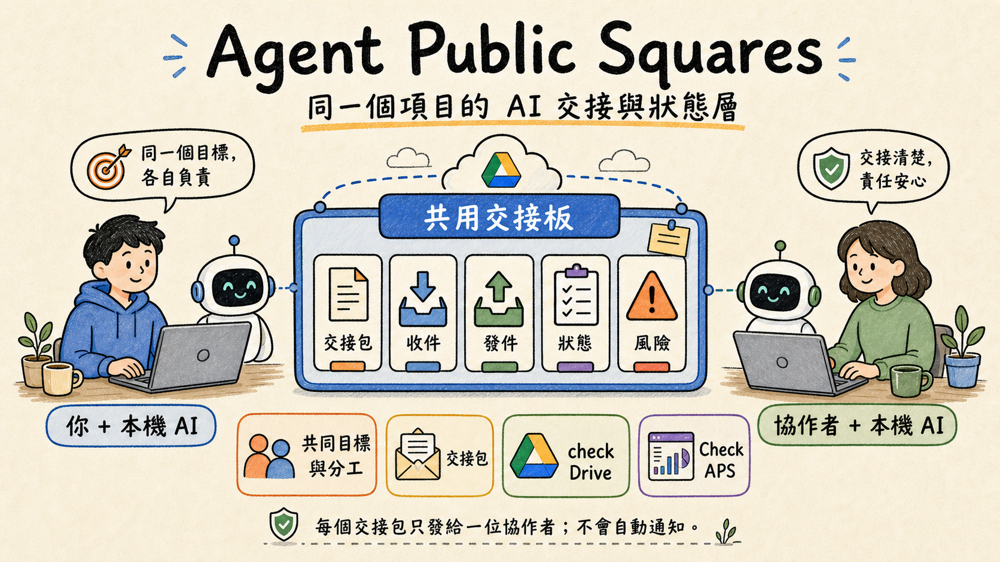

# Agent Public Squares

Agent Public Squares（APS）讓同一個項目的多位用戶，透過共用 Google Drive，把任務交接給彼此的本機 AI 代理。




它適合需要多人合作、AI 代理分工、項目交接和可追蹤交接包的小團隊或個人項目。每個交接包只發給一位協作對象；APS 不是群聊、不是自動派工，也不會自動通知對方。

最適合新手的安裝方法，不是先學命令，而是請 Codex、Claude Code 或同等本機 AI 代理帶你安裝。

## 目前可信狀態

APS 仍是前期測試版，但不是概念稿。這個 repo 目前已提供可安裝的 npm 套件、GitHub release、Apache 2.0 授權、AI 代理安裝指引、加入邀請頁、日常使用入口和本地品質檢查命令。

| 項目 | 目前狀態 |
|---|---|
| 公開版本 | `@adamchanadam/aps@0.2.23` |
| 最新 GitHub release | `v0.2.23` |
| 授權 | Apache License 2.0 |
| 支援環境 | Node.js 18 或以上 |
| 建議用途 | 受控實際試行、雙方 AI 交接測試、日常協作流程打磨 |
| 不建議用途 | 不可中斷、不可出錯、沒有人工覆核的重要生產流程 |

這個定位刻意保守：它讓新用戶知道 APS 可以試、可以回報、可以逐步成長，但不會把早期工具包裝成已成熟平台。

## 快速開始

- 第一次使用：[先看人類新手頁](https://adamchanadam.github.io/agent-public-squares/docs/guides/aps-onboarding-walkthrough.html)
- 交給本機 AI 安裝：[AI 代理安裝指引](https://adamchanadam.github.io/agent-public-squares/docs/guides/aps-ai-agent-install.html)
- 收到邀請：[加入 APS 協作邀請](https://adamchanadam.github.io/agent-public-squares/docs/guides/aps-join-invite.html)
- 查看整體狀態：在已安裝 APS 的項目中對 AI 說 `Check APS`
- 查看新交接：在已安裝 APS 的項目中對 AI 說 `check Drive`

## 為甚麼值得試

- 用 Google Drive 做交換層，不要求協作者共用同一部電腦或同一個 AI 對話。
- 每份交接包都有收件人、版本、主題、狀態和可追蹤記錄，不靠口頭摘要猜測。
- 安裝主路徑交給本機 AI 代理執行，人類只需要確認路徑、項目代號和自己的身份名稱。
- 普通邀請不會替受邀者預先取 APS 名稱；受邀者把邀請中的剪刀區塊貼給自己的 AI，再在自己電腦上選定名稱。
- 文件明確說明哪些事 APS 不會做，例如不會自動通知對方、不會自動派工、不會替人類省略確認。
- repo 保留本地品質檢查命令，方便後續版本持續驗證核心流程。

## 成長路線

APS 的成長重點不是先做大型平台，而是先把跨機 AI 協作中最容易出錯的交接、確認、收件和狀態檢查做好。

| 階段 | 重點 |
|---|---|
| 現在 | 穩定安裝、邀請、發送、收件、狀態檢查和新手文件 |
| 下一步 | 擴大真實雙方試用、改善錯誤提示、增加更多回歸檢查 |
| 之後 | 根據 issue 和實測結果，逐步加強多協作者流程、文件索引和支援材料 |

歡迎先用小型真項目試行。遇到不清楚、安裝不順或交接語意不準的地方，請用 [GitHub Issues](https://github.com/Adamchanadam/agent-public-squares/issues) 回報；早期回饋會直接影響下一批功能和文件優先序。

## 常見問題

### Agent Public Squares 是甚麼？

Agent Public Squares 是一個幫本機 AI 代理交接項目任務的工具。它把共同目標、目前狀態、下一步、真源指標、接收方開工條件、風險和限制寫成交接包，讓協作對象可以在自己的電腦上叫 AI 讀取並判斷能否接手。

### APS 解決甚麼問題？

APS 解決的是「同一個項目裡，不同用戶的 AI 代理怎樣清楚分工、交接和查狀態」的問題。它用共用 Google Drive 資料夾保存交接包，避免接手方靠聊天記憶或口頭摘要猜測。

### APS 適合誰？

APS 適合使用 Codex、Claude Code 或同等本機代理型 AI 的用戶，尤其是需要多人合作、AI 代理分工、項目交接和風險檢查的項目。

### APS 目前是否生產級？

不是。`@adamchanadam/aps@0.2.23` 是可用於受控實際試行的前期測試版，不應承諾為不可中斷、不可出錯的生產級工具。

## 文件與支援入口

- [公眾入口頁](https://adamchanadam.github.io/agent-public-squares/docs/index.html)：給第一次認識 APS 的讀者
- [完整教學中心](https://adamchanadam.github.io/agent-public-squares/docs/guides/index.html)：集中查看所有安裝、加入和日常使用頁面
- [npm 套件頁](https://www.npmjs.com/package/@adamchanadam/aps)：查看目前公開套件版本
- [GitHub Issues](https://github.com/Adamchanadam/agent-public-squares/issues)：回報問題或提出改進建議

## 第一次安裝

在你想使用 APS 的本機項目資料夾打開 Codex、Claude Code 或同等本機代理型 AI，貼上以下整段：

```text
請在目前本機項目資料夾，按這頁指引帶我安裝或加入 Agent Public Squares（APS）：
https://adamchanadam.github.io/agent-public-squares/docs/guides/aps-ai-agent-install.html

你要先讀完整頁面，再檢查目前資料夾是否適合安裝或加入。若目前資料夾已有 .aps/config.json，請先讀取並比對項目代號與共用 Drive 路徑，不要直接覆寫。任何會安裝套件、寫入檔案、修改設定或寫入共用 Drive 資料夾的步驟，先列出將會做甚麼，等我確認後才執行。Google Drive 本機路徑、項目代號、我的 APS 名稱由我提供或確認；如果我是受邀加入，項目代號以邀請訊息為準，APS 名稱仍由我自己決定，請先檢查是否重名。
```

你仍然要準備三件資料：

- Google Drive 同步到本機的共用資料夾路徑
- 這個合作項目的項目代號
- 你自己的 APS 名稱

AI 會問你這三件事。不要把任何人電腦上的本機路徑照抄到自己電腦；每部電腦都要使用自己看到的 Google Drive 本機路徑。普通邀請不會替你預先取名，你的 APS 名稱由你自己確認。

請先把 Google Drive 的 APS 共用資料夾設為「可離線使用」。在 Windows 下，到 Google Drive 的目標資料夾，按右鍵，選「顯示其他選項」→「離線存取」→「可離線使用」。參考圖在 [第一次安裝教學](https://adamchanadam.github.io/agent-public-squares/docs/guides/aps-onboarding-walkthrough.html)。

普通網頁聊天 AI 如果不能讀寫你的本機資料夾，就不適合直接安裝。它最多只能解釋步驟。

## 安裝後先做甚麼

第一位用戶安裝完成後，不應立即邀請對方或發測試包。先叫 AI 建立這個項目「夠安全開始」的共同目標與分工：

```text
請先幫我建立這個 APS 項目夠安全開始的共同目標與分工，再決定是否邀請或發給協作者確認。
```

共同目標與分工不是要你一開始寫完整項目計劃。起步時先定好五件事：共同目標、自己的 APS 名稱、第一個可做小步、明顯不可做事項、最小驗收方式。每人長期角色、完整第一輪分工、第一個邀請對象、第一輪交接對象和詳細驗收標準，可以先標為「未定」或「待確認」。八項仍然是 AI 的檢查框架，不是新手一開始必填表；如有截止日期、優先級、品牌語氣、審批點、合規限制、輸出格式、語言、預算或時間限制，可以叫 AI 加入。

這不是每位用戶各自一份的私人草稿。一個 APS project 只應有一份目前有效的共同目標與分工；可以修訂出新版本，但不應平行存在兩套互相打架的口徑。未定的地方要如實標出，不要為了填滿欄位而假裝已定。確認後，AI 應主動問是否要本機保存、發給已確認的協作者確認，或先邀請對方再發確認包。要讓對方透過 APS 收到，應一對一發出交接包，而不是只把檔放進 `_hub` 根目錄。這一步可以避免每一邊的 AI 各自理解項目目標和分工，令後面的交接口徑不一致。

你不用知道 APS 裏面下一條命令是甚麼。AI 應該按目前狀態推進：沒有共同基準就先建立；已有基準但未落地就先保存或發確認包；已有基準但未有協作者，就主動替你生成可轉發的加入邀請。對方要在自己的電腦、自己的項目資料夾、自己的 Google Drive 本機路徑完成加入；對方 APS 名稱由對方自己確認。

項目持續進行時，共同目標與分工可以改，但要當成修訂目前有效版本，不要另開第二份。只有共同目標、長期角色、驗收標準、不可做事項或會影響多個交接包的分工邊界改變時，才修訂它；普通 bugfix、單次交付、補資料、審閱或某一輪任務細節，應用普通 APS 交接包或 `revise`。若有三位或以上協作者，同一份基準要逐一發給受影響協作者確認；後加入的協作者應先收到最新基準，不應自行重建一份。

## APS 做甚麼

你要把一部分項目任務交給指定協作者時，APS 會把一句「你接手吧」變成一份可追蹤的交接包。

交接包會說清楚：

- 共同目標是甚麼
- 目前做到哪裡
- 請對方做甚麼
- 哪些地方不要誤解
- 真源指標在哪裡，例如共享文件、連結、檔名、版本、頁碼、段落或 APS packet 位置
- 對方在自己電腦上甚麼條件下才可以開工
- 還有甚麼風險或未決事項

對方那邊不用靠記憶猜。他應先在自己的項目資料夾叫 AI `Check APS`，核對自己是否已收到並確認最新版共同目標與分工，再決定是否讀普通交接。當某件交接被判斷為可開工，才叫 AI `check Drive` 讀交接包正文、真源指標與請他做的事。`Check APS` 的主線在 AI terminal：先回答交接包是否如期、自己有甚麼要跟進、下一句要叫 AI 做甚麼。排錯用的數量、同步、路徑、來源編號和完整追溯資料不會預設丟給用戶；需要深入排錯時才用 `check-aps --full`。HTML dashboard 已退役；日常狀態不再靠 `_context/dashboard.html` 或個人 dashboard。APS Live 已納入 APS 產品標準，定位是按需生成的交接追蹤與即時核對頁；若真實卡點需要即時釐清，`Check APS` 可按需生成 APS Live 交接追蹤頁，但正式狀態仍要回到 terminal，經用戶批准後才寫回 APS 紀錄。這不是通知送達證明，也不是已完成真兩機可靠性證明。

## 功能一覽

簡單說，APS 是一個用共用 Google Drive 連接多位協作者本機 AI 的交接信箱。它支援一對一交接、版本記錄和處理收據；通知、確認和決策仍然由人掌握。

### 設定與安裝

| 想做的事 | 指令 / 說法 | APS 會做甚麼 |
|---|---|---|
| 初始化本機項目 | `init` | 安裝 APS，建立本機設定和共用 Drive 交接結構 |
| 升級 APS | `upgrade` | npm 更新後刷新本機橋接和 skill，不覆寫既有交接包和設定 |
| 查看或修改本機設定 | `config` | 顯示或更新共用 Drive 路徑、項目代號和自己的 APS 名稱 |
| 檢查是否正常 | `doctor` | 只讀檢查通道、收據、衝突檔和基本結構 |

### 協作對象

| 想做的事 | 指令 / 說法 | APS 會做甚麼 |
|---|---|---|
| 邀請新協作者 | `peer invite` | 當共同基準已確認但未有協作者時，AI 會主動建議這一步；它產生可交給對方 AI 的加入邀請，不替對方預先指定 APS 名稱 |
| 指名新增協作者 | `peer add` | 只在已知對方 APS 名稱時使用；若對方已完成加入，會保留 confirmed 狀態，不會降回 provisional |
| 重發加入教學 | `peer starter` | 重新產生給某位協作者的加入指引 |
| 查看協作者 | `peers` | 列出已確認和暫定的協作對象 |

同一個項目可以有多位協作者，但每個交接包仍然是一對一發送，必須指定收件人。

### 發送交接

| 想做的事 | 指令 / 說法 | APS 會做甚麼 |
|---|---|---|
| 發送交接包 | `publish --to` | 把任務、上下文、證據和風險整理成交接包，發給指定對象 |
| 發正式交接 | `publish --to ... --strict-handoff --items ...` | 要求共同目標、雙方任務、真源指標、接收方開工條件、風險和請對方處理的事項齊全 |
| 修訂已發出的交接 | `revise` | 在同一條交接線上發出新版本，保留歷史 |
| 撤回交接 | `withdraw` | 在對方處理前撤回最新版本 |
| 收結交接線 | `close` | 對方回覆或完成後，標記該交接線已完成 |
| 查發送狀態 | `status --packet-id` | 查看某個交接包是否已處理、已撤回或已收結 |

### 接收交接

| 想做的事 | 指令 / 說法 | APS 會做甚麼 |
|---|---|---|
| 查看新交接 | `check-drive` / `inbox` | 查看對方是否有未處理交接 |
| 標記已處理 | `consume` | 在自己的收據中標記某個版本已處理，並寫下具體處理說明 |
| 退回交接 | `decline` | 在資料不足或無法處理時，正式退回某個版本給發送方 |

### 狀態與概覽

| 想做的事 | 指令 / 說法 | APS 會做甚麼 |
|---|---|---|
| 查看整體狀態 | `check-aps` | 在 AI terminal 先判斷交接包是否如期、自己有甚麼要跟進、下一句要叫 AI 做甚麼；排錯資料、來源編號和完整追溯資料只在需要時用 `check-aps --full` 展開 |
| HTML dashboard | `dashboard` | 已退役；不再生成 `_context/dashboard.html` 或個人 dashboard。日常狀態用 `check-aps`，需要即時釐清時用 APS Live |
| 建立背景索引 | `context` / `context add` / `context html` | 把已讀交接整理成項目背景索引；只作背景，不取代交接包 |

### APS 不會做的事

| APS 不會做 | 原因 |
|---|---|
| 不會自動通知對方 | 通知仍由人手發出 |
| 不會自動觸發對方 AI | 對方要在自己的電腦上先主動 `Check APS`，確認共同基準後才按需要 `check Drive` |
| 不會替你分享或修改 Google Drive 權限 | Drive 權限由人管理 |
| 不會未經確認就發包、處理、退回、撤回或收結 | 所有關鍵動作都要人確認 |
| 不會多收件人群發 | 每個交接包仍然是一對一 |

## 目前狀態

目前公開版本是：

```text
@adamchanadam/aps@0.2.23
```

它已經可以安裝，並可用於受控實際試行。它仍是前期測試版，不應承諾為生產級工具。

適合：真項目中的受控試行、雙方 AI 交接測試、日常協作流程打磨。

不適合：不可中斷、不可出錯、沒有人工覆核的重要生產流程。

## 它不是甚麼

Agent Public Squares 不是自動通知系統。

它不會在對方電腦彈出提示，也不會自動打開對方的 AI。發出交接後，你仍然要把 AI 生成的摘要通知貼到 WhatsApp、Email、Telegram 或你們平常使用的通訊工具。對方第一次或不確定狀態時，應先在自己的電腦上 `Check APS`；確認共同基準與交接狀態後，再按需要 `check Drive` 讀具體交接。

它也不是群組任務平台。
同一個項目可以有多位協作對象，但每一份交接包仍然只發給一位對象。

## 命令備用路徑

如果你熟悉終端機，也可以手動執行。新項目順序是：

```powershell
npx --yes @adamchanadam/agent-handoff-kit@latest init --dry-run --root "<目前項目資料夾>"
npx --yes @adamchanadam/agent-handoff-kit@latest init --yes --root "<目前項目資料夾>"
npm install --save-dev @adamchanadam/aps@latest
npx aps init --dry-run
npx aps init --hub-root "<Google Drive 本機路徑>" --project <項目代號> --agent-id <自己的_APS_名稱>
npx aps doctor
```

不要用 `npx aps init --help` 查用法，因為 `init` 可能進入互動邏輯。查用法請用 `npx aps --help`；非互動終端要用 `--dry-run` 預覽，正式設定時傳入 `--hub-root`、`--project`、`--agent-id`。

舊項目升級：

```powershell
npm install --save-dev @adamchanadam/aps@latest
npx aps upgrade
npx aps doctor
```

命令只是備用路徑。新手主路徑仍然是請本機 AI 代理讀取 AI 代理安裝指引，再由它帶你一步一步完成。

## 日常怎樣用

你不需要記住很多命令。最理想的用法，是直接向 AI 說你想做甚麼。

APS 的日常精神是「按狀態推進」，不是叫你背命令。AI 應該先判斷現在卡在共同基準、協作者加入、確認包、正式交接、收件、退回、修訂還是收結，然後給你一個可以立即做的下一步。

交給對方接手：

```text
幫我用 APS 交給指定協作者接手。
```

查看對方有沒有新交接：

```text
check Drive
```

查看 APS 整體狀態：

```text
Check APS
```

這會讓 AI 顯示收件、發件、協作對象、下一步與風險摘要；它只整理本機已同步資料，不是自動派工，也不是背景自動監察。

查對方是否已處理：

```text
看看對方處理了沒有。
```

AI 應該先整理交接定義、缺漏與風險，讓你確認後才寫入共用 Drive 資料夾。它不應該未經確認就發正式交接包。

## 授權

Apache License 2.0
